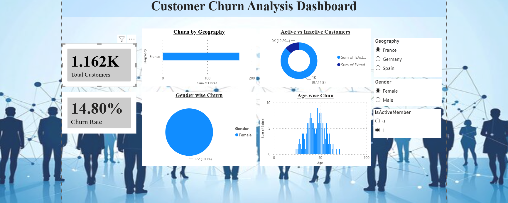

# 📊 Customer Churn Analysis Dashboard

## 📌 Project Overview

This project analyzes customer churn using **MySQL**, **SQL**, and **Power BI**. The objective is to identify customer churn patterns, understand the factors contributing to customer loss, and provide actionable business insights to improve customer retention.

The project demonstrates the complete analytics workflow—from data storage and SQL analysis to interactive dashboard creation and business storytelling.

---

## 🚀 Technologies Used

- MySQL
- SQL
- Power BI
- DAX
- CSV Dataset

---

## 📂 Dataset

Dataset: **Bank Customer Churn Dataset**

The dataset contains customer information including:

- Customer ID
- Geography
- Gender
- Age
- Credit Score
- Balance
- Number of Products
- Active Member Status
- Estimated Salary
- Churn Status (Exited)

---

## 🎯 Project Objectives

- Analyze customer churn trends.
- Calculate overall churn rate.
- Compare churn across different regions.
- Analyze churn by gender and age.
- Compare active and inactive customer behavior.
- Build an interactive dashboard for business decision-making.

---

## 🗄️ SQL Analysis

The following SQL analyses were performed:

- Total Customers
- Churn Rate
- Churn by Geography
- Churn by Gender
- Active vs Inactive Customers
- Age-wise Churn Analysis

---

## 📊 Dashboard Features

### KPI Cards

- Total Customers
- Churn Rate

### Interactive Visualizations

- Churn by Geography
- Gender-wise Churn
- Active vs Inactive Customers
- Age-wise Churn Analysis

### Filters (Slicers)

- Geography
- Gender
- Active Member Status

---

## 🔍 Key Insights

- Germany experienced the highest customer churn.
- Inactive customers were more likely to churn.
- Middle-aged customers showed higher churn patterns.
- Customer engagement appears to have a strong impact on retention.

---

## 💼 Business Recommendations

- Improve engagement strategies for inactive customers.
- Launch personalized retention campaigns.
- Introduce loyalty programs for long-term customers.
- Focus on improving customer onboarding and satisfaction.

---

## 📁 Project Structure

```text
customer-churn-analysis-dashboard/
│
├── dataset/
│   └── Churn_Modelling.csv
│
├── powerbi/
│   └── customer_churn_dashboard.pbix
│
├── sql/
│   └── analysis_queries.sql
│
├── screenshots/
│   └── dashboard.png
│
├── README.md
│
└── LICENSE
```

---

## 📸 Dashboard Preview




---

## 🚀 Future Improvements

- Predict customer churn using Machine Learning.
- Build a Streamlit web application.
- Add advanced DAX calculations.
- Include customer segmentation analysis.
- Create an executive summary dashboard.

---

## 👩‍💻 Author

**Lakshita Nair**


